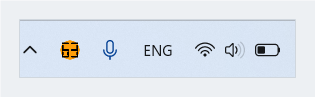
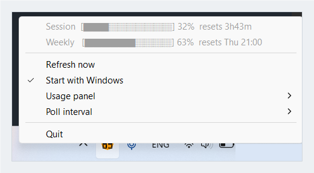

# Claude Usage Widget

A tiny Windows system-tray widget that shows your [Claude Code](https://claude.com/claude-code)
subscription usage at a glance: how much of your rolling 5-hour session
window and 7-day weekly window you've used, and when each one resets.

No dashboard, no browser tab, no `/usage` command to remember - just a
colored, badged dot in your system tray, plus an optional floating panel
with real progress bars if you want more than a glance.


### [**⬇ Download claude-usage-widget.exe**](https://github.com/SikamikanikoBG/claude-usage-widget/releases/latest/download/claude-usage-widget.exe)

That link always points at the latest release - no need to hunt through
version numbers. See [Install](#install-no-rust-required) below for what
to expect on first run.

## Install (no Rust required)

1. Grab the latest `claude-usage-widget.exe` - either the direct link above,
   or from the [Releases page](https://github.com/SikamikanikoBG/claude-usage-widget/releases)
   if you'd rather see release notes/pick an older version first.
2. Run it. That's it - no installer, no admin rights, nothing else to set up.
3. Windows may show a SmartScreen warning ("Windows protected your PC") because
   the binary isn't code-signed. Click **More info -> Run anyway**. This is
   normal for small open-source tools - the source is right here if you want
   to check it or build it yourself instead (see [Building from source](#building-from-source)).
4. First run: look in the system tray overflow (the `^` arrow near the clock) -
   new tray icons default to hidden on Windows. Drag it out (or enable it via
   *Settings -> Personalization -> Taskbar -> Other system tray icons*) to
   keep it always visible. The widget also tries to self-promote its icon out
   of the overflow area automatically (see [Privacy / what it talks to and
   touches](#privacy--what-it-talks-to-and-touches)) - if that doesn't take
   effect right away, dragging it out manually always works.
5. You'll need to have signed in at least once with the `claude` CLI so its
   credentials file exists (see
   [Reliability](#reliability-refresh-backoff-and-why-gray) below).

## Features

### Tray icon



A small filled circle, color-coded by your highest current utilization
across both windows, with that percentage drawn directly on the icon as
bold, rounded, anti-aliased seven-segment digits (like a digital clock) - no
hovering needed to read the number:

- **Green**: under 50%
- **Amber**: 50-80%
- **Red**: over 80%
- **Gray, no digits**: usage data isn't available right now (see
  [Reliability](#reliability-refresh-backoff-and-why-gray) for what that
  actually means)

The badge colors are flat, muted tones closer to iOS/macOS system status
colors than fully-saturated primary colors, and the digits are rendered as
one solid color with soft anti-aliased edges and a small gap between
segments - deliberately not a small pixel font with an outline, which turned
out to be illegible at real tray-icon size (see [CHANGELOG.md](CHANGELOG.md)
for why).

### CPU temperature icon


A second tray icon sits next to the usage one showing the current CPU
temperature in degrees Celsius, in the same circular badge style:

- **Green**: under 70 °C
- **Amber**: 70-84 °C
- **Red**: 85 °C and above
- **Gray, no digits**: this machine exposes no usable thermal sensor, or the
  last sample failed

It refreshes every 5 seconds. Unlike the usage poll there's nothing to
configure and no reason to slow it down - it reads a local Windows
performance counter, so it costs nothing and talks to no one.

Turn it off (or back on) with **Show CPU temperature** in the right-click
menu; it's on by default and the choice is remembered. Right-clicking either
icon opens the same menu.

**This needs no administrator rights.** The usual way to read CPU temperature
on Windows is the `MSAcpi_ThermalZoneTemperature` WMI class, which requires
elevation, and third-party sensor tools generally need a kernel driver on top
of that. This widget reads the `Thermal Zone Information` performance
counters, which a normal user can read, so it stays unelevated like the rest
of the app.

The trade-off is that it reports what the firmware's ACPI thermal zones
report. On a machine that exposes a CPU-specific zone that's exactly what you
get; where firmware only exposes generic zones, the widget shows the hottest
plausible one. Machines with no thermal zones at all - most virtual machines,
some desktops - show the gray icon. It is not a substitute for a dedicated
sensor tool if you want per-core detail.

### Tooltip

Hovering the icon shows a three-line summary - the live session and weekly
windows, plus where your weekly usage is projected to land at reset:

```
Session 12% 3h40m
Weekly 54% Wed 18:00
Projected 71% under
```

The wording is terse on purpose. Windows silently truncates tray tooltips at
63 characters, so every line here is written to fit inside that budget, with
a test that fails the build if it ever stops fitting. (Before v0.6.0 it
didn't fit: the tooltip was cut off mid-word and the projected line rendered
as the single fragment `Pr`.)

### Right-click menu



The same two numbers as text progress bars, plus controls:

```
Session  [██░░░░░░░░] 12%  resets 3h40m
Weekly   [█████░░░░░] 54%  resets Wed 18:00
Projected [███████░░░] 71% (under)
---------------------------------------------
Refresh now
✓ Start with Windows
✓ Show CPU temperature
Usage panel        >
Poll interval       >
---------------------------------------------
Quit
```

If your account has "extra usage" (pay-as-you-go credits beyond the plan
limit) enabled, a fourth informational line shows up right below the three
above:

```
Session  [██░░░░░░░░] 12%  resets 3h40m
Weekly   [█████░░░░░] 54%  resets Wed 18:00
Projected [███████░░░] 71% (under)
Extra usage  [██░░░░░░░░] 12%  42.50/850.00 EUR
---------------------------------------------
...
```

It's left out entirely when extra usage isn't enabled on your account, which
is the common case.

- **Refresh now** - forces an immediate re-check without waiting for the
  timer, unless the widget is currently backing off after a failed request
  (see [Reliability](#reliability-refresh-backoff-and-why-gray) below), in
  which case it's deliberately ignored until the backoff clears.
- **Start with Windows** - toggles launching the widget at sign-in.
- **Usage panel** submenu - a **Show panel** checkbox, four mutually
  exclusive display-mode options (**Both**, **5-hour only**, **Weekly only**,
  **Rotating**), an **Opacity** submenu and **Reset position**. See
  [Floating usage panel](#floating-usage-panel) below.
- **Poll interval** submenu - **1 minute**, **2 minutes**, **5 minutes**
  (default), **10 minutes**. Changing it applies immediately, no restart
  needed. 1 minute is a hard floor enforced in code, not just in the list of
  offered choices - this widget will never poll faster than that.
- **Quit**.

Hovering or clicking the tray icon itself does **not** trigger a network
request - it just shows whatever was last fetched. "Refresh now" is the only
way to force a check outside of the timer.

### Floating usage panel

An optional always-on-top window, off by default, starting in the
bottom-right corner of your primary monitor's work area (above the taskbar,
not under it), with real drawn progress bars instead of text. Turn it on from
the tray menu's **Usage panel** submenu, which also lets you pick what it
shows: **Both** (Session + Weekly + Projected, stacked), **5-hour only**,
**Weekly only** (weekly plus its projection), or **Rotating** (cycles Session
→ Weekly → Projected every 2 seconds). The panel resizes itself to fit
whichever mode you pick.

**Move it anywhere.** Drag the panel by clicking anywhere on it - there's no
title bar, the whole surface is the grab handle. Where you drop it is
remembered across restarts. If the panel ever ends up somewhere you can't
reach it (dragged onto a monitor you later unplugged, say), **Reset position**
in the same submenu puts it back in the default corner - and the widget will
already have done that for you on start-up if it noticed the saved spot was
off-screen.

**Opacity.** Choose **30%**, **50%**, **70%** (the default), **85%** or
**100%** from the **Opacity** submenu. At the default the panel is perfectly
readable while still letting you see what's underneath it, so it can sit on
top of your editor without covering anything up. The change applies
immediately, while the menu is still open.

Visibility, display mode, opacity and position are all remembered across
restarts.

### Threshold notification

If either window's utilization crosses 90% (from below 90% up to 90% or
higher), you'll get a one-time Windows balloon notification, e.g. "Session at
92%, resets in 1h20m". It won't repeat again for that same crossing - only
once the number drops back below 90% and later crosses again.

### Single instance

Only one copy of the widget runs at a time: if you double-click the exe
while it's already running (or "Start with Windows" launches it and you also
start it manually), the second copy notices, prints a message, and exits
immediately instead of creating a duplicate tray icon.

### Log file

The widget writes a plain-text diagnostic log to:

```
%LOCALAPPDATA%\ClaudeUsageWidget\widget.log
```

It records one line per successful poll, every backoff decision, and what the
floating panel did on start-up (where it was placed, whether it actually
became visible). It rotates to `widget.log.old` once it passes 1 MB, so it
can't grow without bound.

This is the first place to look if something misbehaves - and the thing to
attach to a bug report. It contains no tokens and no personal data: just
percentages, timings and window coordinates.

## Reliability: refresh, backoff, and "why gray?"

Claude Code caches your OAuth session locally at
`%USERPROFILE%\.claude\.credentials.json` after you sign in with the
`claude` CLI. This widget reads the `accessToken` out of that file (fresh,
on every poll) and calls Anthropic's usage endpoint with it - the same way
Claude Code's own statusline gets its numbers. This is an **undocumented**
endpoint with no public token-refresh flow.

The icon turns gray whenever a fetch fails, but the tooltip/menu text tells
you *why*, because the fix is different depending on the cause:

- **"sign-in needed"** - the credentials file is missing, unparseable, or the
  server rejected the token outright (HTTP 401/403). This is the one case
  that actually needs you to do something: run `claude` once to refresh your
  session, and the widget picks up the new token on its next check.
- **"rate-limited, retrying"** - this endpoint has its own rate limit,
  separate from your actual usage quota. The widget backs off automatically
  and recovers on its own - no action needed, and manual refreshes are
  ignored during the backoff so they can't make it worse.
- **"network error, retrying"** / **"unavailable, retrying"** - a
  connectivity hiccup or an unexpected response shape; also self-recovers on
  the next poll.

Failures use **two separate backoff schedules**, not one, because they don't
behave the same way in practice:

- An actual **HTTP 429** gets a cautious exponential backoff (doubling from
  the current poll interval, capped at 5 minutes), and respects a
  server-sent `Retry-After` header when there's a sane one to trust - a
  `Retry-After: 0` observed live while actively rate-limited is treated as a
  floor, not something that can shrink the backoff below the computed
  schedule.
- Everything else - a network error, an unparseable response, a token
  problem - gets a much faster **5-second to 60-second** schedule instead.
  These are usually short-lived hiccups (a stale connection surviving a
  sleep/wake cycle, for example) that don't need minutes to recover from; a
  network-transport-level failure specifically also rebuilds the HTTP client
  before the next attempt, in case the connection itself was the problem.

Both schedules reset back to the normal poll interval on the next success.

## Privacy / what it talks to and touches

This widget makes network requests to **`api.anthropic.com` only**, using
**your own already-cached token** - nothing else, no analytics, no
telemetry, no third-party service.

It reads exactly one local file: your existing Claude Code credentials cache
at `%USERPROFILE%\.claude\.credentials.json`.

For the CPU temperature it reads the local `Thermal Zone Information`
performance counters through Windows' own PDH API. That's a read-only query
against data Windows already publishes to any user; it needs no elevation,
installs no driver, and sends nothing anywhere.

It writes to exactly three registry locations, and nothing else:

- `HKEY_CURRENT_USER\Software\Microsoft\Windows\CurrentVersion\Run` - the
  standard per-user autostart key, and only the single `ClaudeUsageWidget`
  value in it. Written only if you turn on "Start with Windows"; removed
  again if you turn it off.
- `HKEY_CURRENT_USER\Software\ClaudeUsageWidget` - this widget's own
  settings key, holding the floating panel's visibility, mode, opacity and
  dragged-to position, the configured poll interval, and whether the CPU
  temperature icon is shown. Updated whenever you change those from the tray
  menu or move the panel.
- `HKEY_CURRENT_USER\Control Panel\NotifyIconSettings` - a key Windows
  itself owns and maintains for every app that has ever registered a tray
  icon. The widget only sets the `IsPromoted` value (a DWORD) on its own
  existing subkey there, to ask Windows to keep the icon always visible
  instead of hidden behind the overflow chevron. It doesn't create this key
  or touch any other app's entry in it.

It writes no files of its own. The source is small enough to read end to end
in a few minutes - that's the point of it being open source.

## Building from source

Requirements:
- Rust (stable), MSVC toolchain (`x86_64-pc-windows-msvc`)
- Windows 10/11

```powershell
git clone https://github.com/SikamikanikoBG/claude-usage-widget.git
cd claude-usage-widget
cargo build --release
```

The binary is produced at `target\release\claude-usage-widget.exe`. It's a
single self-contained executable - copy it wherever you like and run it.

## Running

Just double-click `claude-usage-widget.exe`, or run it from a terminal. It
has no window - only a tray icon appears (look in the system tray overflow
arrow if you don't see it right away). You'll need to have signed in with
Claude Code at least once (`claude` CLI) so the credentials file exists.

To have it launch automatically at sign-in, right-click the tray icon and
check "Start with Windows".

## How it works, internally

- A background thread polls `GET https://api.anthropic.com/api/oauth/usage`
  at your configured interval (1-10 minutes, 5-minute default, 1-minute
  floor), re-reading the credentials file on every attempt so it picks up a
  refreshed token without needing a restart.
- On failure, it uses one of the two backoff schedules described above
  (429 vs. everything else), tracked as a count of consecutive failures that
  resets to zero on the next success.
- A named Win32 mutex (`Global\ClaudeUsageWidget_SingleInstance`) guards
  against two copies running at once; a second launch detects the existing
  mutex and exits immediately, before creating any UI.
- The tray icon is rendered in memory (anti-aliased filled circle with bold
  seven-segment digits blitted on top) rather than shipped as a static asset
  file, so the color and number always match the live data.
- CPU temperature comes from a separate 5-second thread holding one open PDH
  query against `\Thermal Zone Information(*)\High Precision Temperature`
  (falling back to the whole-Kelvin `\...\Temperature` counter). Counter names
  are localized on non-English Windows, so it binds via
  `PdhAddEnglishCounterW` rather than the localized path. Readings arrive in
  Kelvin; zones that aren't wired to a sensor report absolute zero and are
  filtered out, a CPU-named zone is preferred when the firmware exposes one,
  and otherwise the hottest plausible zone wins.
- The floating usage panel is a plain always-on-top Win32 popup window,
  positioned from the primary monitor's work area, drawn with raw GDI calls -
  no extra windowing/UI crate.
- The 90%-threshold notification is a plain Win32 balloon/toast shown via
  `Shell_NotifyIconW`, not a separate notification library.
- Built with [`tray-icon`](https://crates.io/crates/tray-icon) +
  [`tao`](https://crates.io/crates/tao) for a minimal tray/event-loop stack
  (deliberately not pulling in a full webview), `reqwest` (rustls, no
  OpenSSL dependency) for HTTP, `winreg` for settings, and `windows-sys` for
  the single-instance mutex, balloon notification, and floating panel window.

## Limitations

- Windows only.
- Depends on an undocumented Anthropic endpoint that could change or move
  without notice; if it does, the widget will simply show "unavailable,
  retrying" until it's updated.
- No historical charts or trend graphs - it's intentionally just the
  at-a-glance tray view, the optional floating panel, and the one
  90%-threshold notification.
- The CPU temperature is only as good as what the firmware's ACPI thermal
  zones report, and some machines (most VMs, some desktops) expose none at
  all. There's no per-core breakdown and no temperature alerting - if you need
  either, you want a dedicated sensor tool, not this.

## License

MIT - see [LICENSE](LICENSE).
